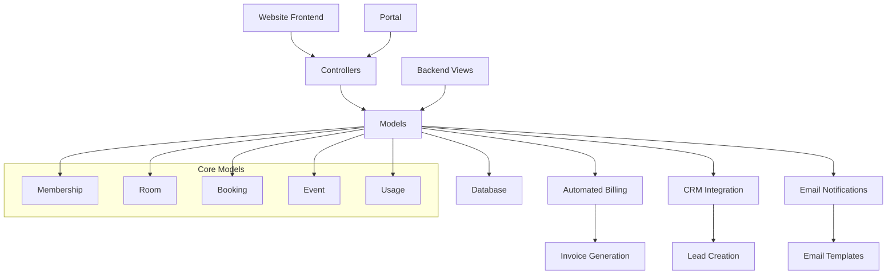
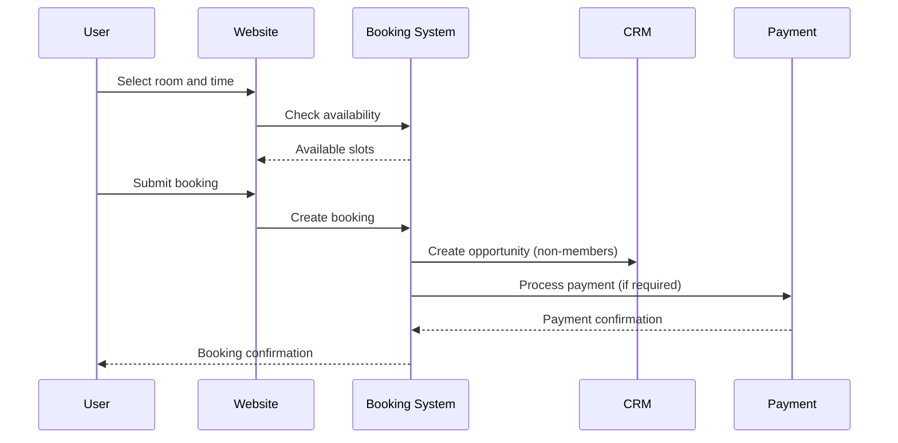
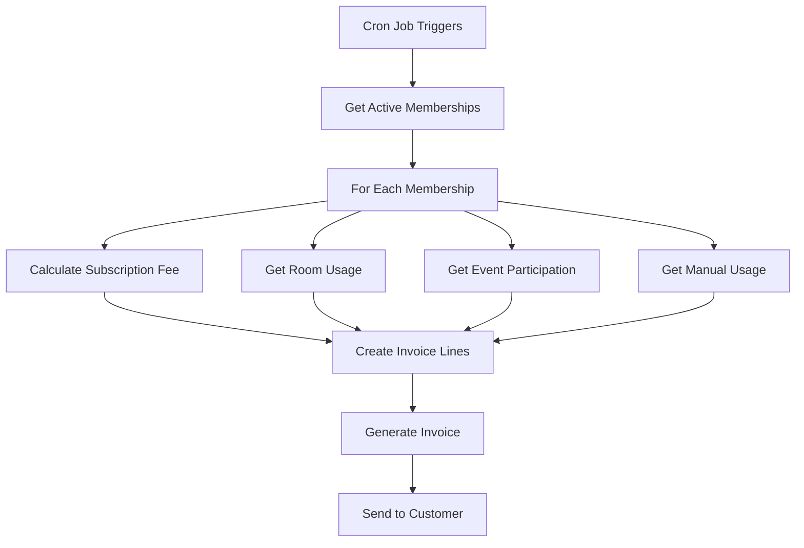

# Coworking Space Management System

## Overview

This Odoo addon provides a comprehensive solution for managing coworking spaces, including membership management, room booking, event registration, and automated billing. The system is designed to handle different subscription plans and provide both member and non-member access to services.

## Features

### 🏢 Membership Management
- **Multiple Subscription Plans**: Unlimited (€20/month), Partial (€5/month), Pay-As-You-Go (€10 for 10 hours)
- **Automated Membership Lifecycle**: Draft → Active → Suspended/Expired/Cancelled
- **Credit-based System**: For Pay-As-You-Go plans with automatic credit consumption
- **Member Portal**: Self-service portal for members to manage their account

### 🏠 Meeting Room Booking
- **Real-time Availability**: Check room availability with conflict detection
- **Multi-user Access**: Both members and non-members can book rooms
- **Automated Pricing**: Different rates based on membership type
- **CRM Integration**: Automatic opportunity creation for non-member bookings
- **Calendar Integration**: Visual booking calendar with drag-and-drop functionality

### 🎉 Event Management
- **Event Registration**: Online registration with payment integration
- **Member Benefits**: Free or discounted access based on membership plan
- **Capacity Management**: Automatic seat availability tracking
- **Email Notifications**: Automated confirmation emails

### 💰 Automated Billing
- **Monthly Invoice Generation**: Automated billing on the 1st of each month
- **Variable Billing**: Based on actual usage (meeting rooms, events, manual entries)
- **Multiple Revenue Streams**: Subscription fees, room bookings, event fees
- **Usage Tracking**: Detailed tracking of all billable activities

### 🌐 Website Integration
- **Public Booking Interface**: Non-members can book rooms and register for events
- **Member Portal**: Dedicated portal for members with usage statistics
- **Payment Integration**: Stripe integration for online payments
- **Responsive Design**: Mobile-friendly interface

## System Architecture



## Data Model

### Core Entities

1. **Coworking Membership Plan**
   - Defines subscription types and access levels
   - Pricing and credit allocation
   - Access permissions for different services

2. **Coworking Membership**
   - Links partners to membership plans
   - Tracks membership lifecycle and credit balance
   - Manages auto-renewal and billing

3. **Coworking Room**
   - Room details, capacity, and equipment
   - Availability schedules and pricing
   - Equipment and amenity associations

4. **Coworking Booking**
   - Room reservations with time slots
   - Member vs non-member pricing
   - State management and payment tracking

5. **Coworking Event**
   - Event details and registration management
   - Capacity and pricing configuration
   - Member vs non-member access

6. **Coworking Usage**
   - Manual usage entry for billing
   - Tracks coworking space usage hours
   - Links to automated billing system

## Installation Guide

### Prerequisites
- Odoo 18.0 or later
- Python 3.8+
- PostgreSQL 12+

### Installation Steps

1. **Copy the addon to your Odoo addons directory:**
   ```bash
   cp -r coworking_space /path/to/odoo/addons/
   ```

2. **Update the addons list:**
   ```bash
   ./odoo-bin -u all -d your_database
   ```

3. **Install the addon:**
   - Go to Apps menu in Odoo
   - Search for "Coworking Space Management"
   - Click Install

4. **Configure the system:**
   - Set up membership plans
   - Create rooms and equipment
   - Configure email templates
   - Set up payment providers (for Stripe integration)

### Dependencies
The addon depends on the following Odoo modules:
- `base` - Core Odoo functionality
- `website` - Website framework
- `website_sale` - E-commerce functionality
- `website_event` - Event management
- `sale` - Sales management
- `sale_subscription` - Subscription management
- `account` - Accounting
- `crm` - Customer relationship management
- `event` - Event management
- `portal` - Customer portal
- `payment` - Payment processing

## Configuration

### 1. Membership Plans Setup
Navigate to **Coworking → Configuration → Membership Plans** and configure:
- Plan names and codes
- Monthly pricing
- Access levels for each service type
- Credit amounts for Pay-As-You-Go plans

### 2. Room Configuration
Go to **Coworking → Configuration → Rooms** and set up:
- Room details (name, capacity, location)
- Equipment and amenities
- Availability schedules
- Hourly rates

### 3. Email Templates
Configure email templates in **Settings → Technical → Email Templates**:
- Booking confirmation emails
- Event registration confirmations
- Monthly invoice notifications

### 4. Payment Configuration
Set up payment providers in **Website → Configuration → Payment Providers**:
- Configure Stripe for online payments
- Set up payment methods for different services

## Usage Guide

### For Administrators

#### Managing Memberships
1. **Create New Membership:**
   - Go to Coworking → Memberships
   - Click Create and select partner and plan
   - Set start date and activate

2. **Monitor Usage:**
   - View usage statistics in member profiles
   - Track credit balances for Pay-As-You-Go members
   - Generate usage reports

#### Room Management
1. **Add New Rooms:**
   - Go to Coworking → Configuration → Rooms
   - Set capacity, equipment, and availability
   - Upload room images

2. **Monitor Bookings:**
   - View booking calendar
   - Approve/reject non-member bookings
   - Handle cancellations and refunds

#### Event Management
1. **Create Events:**
   - Go to Coworking → Events
   - Set event details, capacity, and pricing
   - Publish to website

2. **Manage Registrations:**
   - Monitor registration numbers
   - Process payments
   - Send event updates

#### Billing Management
1. **Generate Monthly Invoices:**
   - Go to Coworking → Billing → Generate Invoices
   - Select period and options
   - Review and validate invoices

2. **Track Revenue:**
   - Monitor subscription revenue
   - Analyze room booking income
   - Track event participation fees

### For Members

#### Using the Portal
1. **Access Member Portal:**
   - Login to website
   - Navigate to "My Account" → "Coworking"

2. **Book Meeting Rooms:**
   - View available rooms
   - Select time slots
   - Confirm bookings

3. **Register for Events:**
   - Browse upcoming events
   - Register with member pricing
   - View registration history

4. **Track Usage:**
   - View current month usage
   - Check credit balance (Pay-As-You-Go)
   - Add manual usage entries

### For Non-Members

#### Booking Services
1. **Room Booking:**
   - Visit coworking website
   - Select room and time slot
   - Provide contact information
   - Complete payment

2. **Event Registration:**
   - Browse public events
   - Register and pay online
   - Receive confirmation email

## API Endpoints

### Public API
- `GET /coworking/api/room/availability` - Check room availability
- `POST /coworking/api/booking/create` - Create new booking
- `GET /coworking/api/room/slots` - Get available time slots

### Member API
- `POST /coworking/api/event/register` - Register for events
- `POST /coworking/api/booking/cancel` - Cancel bookings
- `POST /coworking/api/booking/reschedule` - Reschedule bookings

## Development Process

### 1. Requirements Analysis ✅
- Analyzed PDF requirements document
- Identified core features and user stories
- Defined technical architecture

### 2. Model Design ✅
- Created comprehensive data models
- Implemented business logic and constraints
- Added computed fields and automation

### 3. Controller Development ✅
- Built website controllers for public access
- Implemented portal controllers for members
- Created API endpoints for AJAX functionality

### 4. Security Implementation ✅
- Defined user groups and access rights
- Implemented record-level security rules
- Protected sensitive operations

### 5. Integration ✅
- Integrated with existing Odoo modules
- Implemented automated billing system
- Added CRM opportunity creation

### 6. Testing & Documentation ✅
- Created comprehensive documentation
- Provided installation and usage guides
- Documented API endpoints

## Customization

### Adding New Membership Plans
1. Create new plan record in `coworking.membership.plan`
2. Define access levels and pricing
3. Update website templates if needed

### Custom Room Types
1. Extend `coworking.room` model
2. Add new fields for specific requirements
3. Update booking logic if necessary

### Additional Services
1. Create new models for services
2. Integrate with billing system
3. Add to member portal

## Troubleshooting

### Common Issues

1. **Booking Conflicts:**
   - Check room availability logic
   - Verify datetime handling
   - Review booking state management

2. **Payment Issues:**
   - Verify payment provider configuration
   - Check webhook endpoints
   - Review transaction logs

3. **Email Notifications:**
   - Verify SMTP configuration
   - Check email template syntax
   - Review mail server logs

### Support

For technical support and customization requests:
- Email: support@luminouslabsbd.com
- Documentation: [Internal Wiki]
- Issue Tracker: [GitHub Repository]

## License

This addon is licensed under LGPL-3. See LICENSE file for details.

## Technical Implementation Details

### Database Schema

#### Membership Management
```sql
-- Core membership tables
coworking_membership_plan (id, name, code, monthly_price, access_levels)
coworking_membership (id, partner_id, plan_id, state, credit_balance)
```

#### Booking System
```sql
-- Room and booking tables
coworking_room (id, name, capacity, hourly_rate, availability_schedule)
coworking_booking (id, room_id, partner_id, start_datetime, end_datetime, state)
```

#### Event Management
```sql
-- Event tables
coworking_event (id, name, date_begin, date_end, seats_max, pricing)
coworking_event_registration (id, event_id, partner_id, state, price)
```

### Business Logic Flow

#### Booking Process


#### Monthly Billing Process


### Performance Considerations

#### Database Optimization
- Indexed fields: `partner_id`, `start_datetime`, `state`
- Computed fields with `store=True` for frequently accessed data
- Proper foreign key relationships with `ondelete` constraints

#### Caching Strategy
- Room availability cached for 5 minutes
- Membership data cached per session
- Event data cached until modification

#### Scalability Features
- Pagination for large datasets
- Lazy loading for related records
- Efficient search domains

### Security Implementation

#### Access Control
```python
# Record rules example
domain_force = [
    '|',
    ('partner_id.user_ids', 'in', user.id),
    ('create_uid', '=', user.id)
]
```

#### Data Protection
- Partner data accessible only to owners
- Booking data filtered by user access
- Payment information encrypted

### Integration Points

#### CRM Integration
- Automatic lead creation for non-member bookings
- Opportunity tracking for upselling
- Customer journey mapping

#### Accounting Integration
- Automated invoice generation
- Revenue recognition by service type
- Tax calculation and compliance

#### Website Integration
- SEO-optimized pages
- Mobile-responsive design
- Progressive web app features

### Monitoring and Analytics

#### Key Metrics
- Room utilization rates
- Member retention rates
- Revenue per member
- Booking conversion rates

#### Reporting Features
- Monthly revenue reports
- Usage analytics
- Member activity dashboards
- Operational efficiency metrics

### Deployment Checklist

#### Pre-deployment
- [ ] Database backup
- [ ] Test environment validation
- [ ] Security audit
- [ ] Performance testing

#### Post-deployment
- [ ] Monitor error logs
- [ ] Verify email delivery
- [ ] Test payment processing
- [ ] User acceptance testing

### Maintenance Tasks

#### Daily
- Monitor booking conflicts
- Check payment processing
- Review error logs

#### Weekly
- Generate usage reports
- Update room availability
- Process refunds

#### Monthly
- Generate invoices
- Analyze performance metrics
- Update membership statuses

---

**Developed by Luminous Labs BD**
*Empowering businesses with innovative technology solutions*
